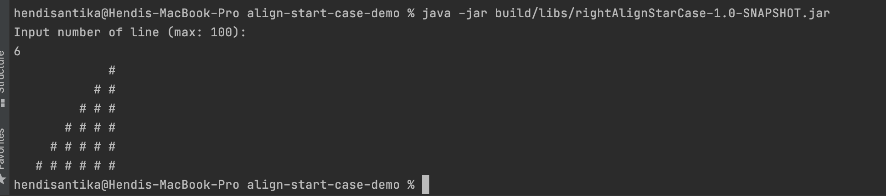

# align-start-case

### Things to do list:

> I assume that JDK8 & Gradle already installed on your environment.

1. Clone this repository: `git clone https://github.com/hendisantika/align-start-case-demo.git`.
2. Go inside clone folder: `cd align-start-case-demo`.
3. Build your application using gradle: `gradle clean build`
3. Run your application using gradle: `java -jar build/libs/rightAlignStarCase-1.0-SNAPSHOT.jar`

### Screen shot

Run application

